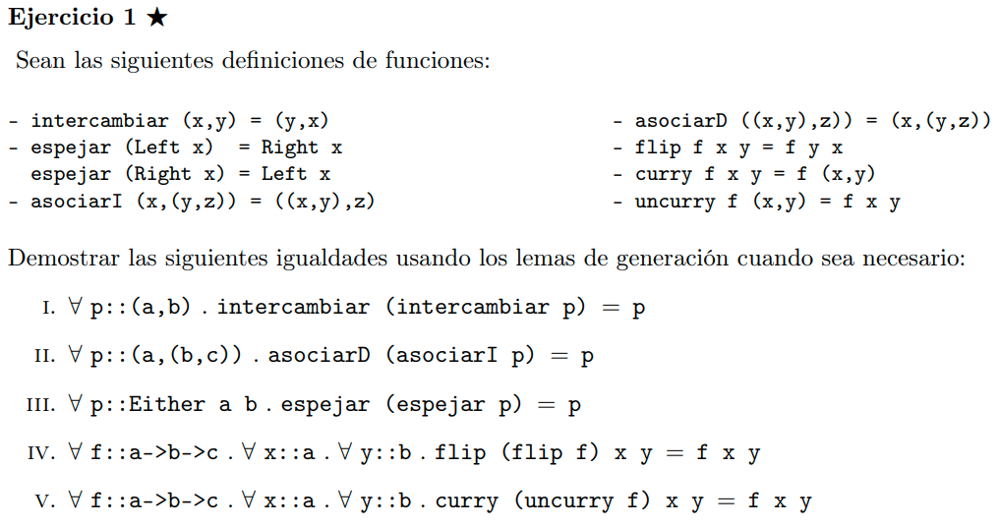
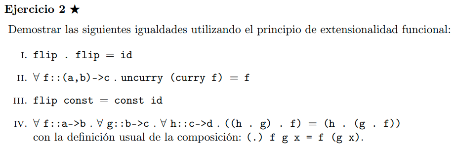
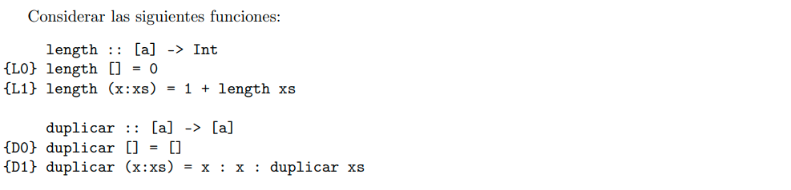
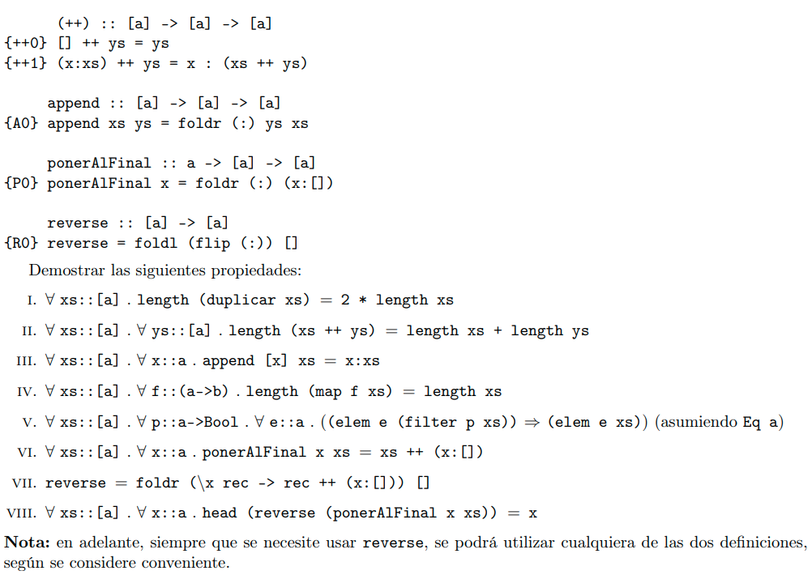

# Notas

- Generalmente vamos a demostrar igualdad entre dos funciones, la funcion del lado izquierdo la vamos a llamar LHS (left hand side), mientras que la funcion del lado derecho la vamos a llamar RHS (right hand side).

# Ejercicio 1



## Inciso I

Definiciones

```haskell
{I} intercambiar (x,y) = (y, x)
```

Queremos demostrar la siguiente igualdad: `∀ p :: (a, b). intercambiar (intercambiar p) = p`

Por principio de extensionalidad, basta ver que ambos lados de la igualdad generan la misma imagen para todo posible par.

Como p es un par, por lema de generación podemos reescribir a p de la siguiente manera:

- ∀x :: a. ∀y :: b. p = (x, y)

Dicho esto, queremos ver que `intercambiar (intercambiar (x, y)) = (x, y)` (No volvemos a escribir los para todos, pero están).

```haskell
-- LHS
intercambiar (intercambiar (x, y))
= {I} intercambiar ((y, x))
= {I} (x, y)

-- RHS
(x, y)
```

Vemos que despues de desarrollar la LSH, llegamos a lo mismo que RHS. Por lo tanto, queda probada la igualdad.

## Inciso II

Definiciones

```haskell
{I} asociarI (x, (y, z)) = ((x, y), z)

{D} asociarD ((x, y), z) = (x, (y, z))
```

Queremos demostrar la siguiente igualdad: `∀ p :: (a, (b, c)) . asociarD (asociarI p) = p`

Por principio de extensionalidad, basta ver que ambos lados de la igualdad generan la misma imagen para toda posible par.

Por lema de generacion, podemos reescribir a p de la siguiente manera:

- ∀x :: a. ∀y :: b. ∀z :: c. p = (x, (y, z))

Dicho esto, queremos ver que `asociarD (asociarI (x, (y, z))) = (x, (y, z))`

```haskell
-- LHS
asociarD (asociarI (x, (y, z)))
= {I} asociarD ((x, y), z)
= {D} (x, (y, z))

-- RHS
(x, (y, z))
```

Vemos que despues de desarrollar la LHS, llegamos a lo mismo que RHS. Por lo tanto queda probada la igualdad.

## Inciso IV

```haskell
{F} flip f x y = f y x
```

Queremos demostrar la siguiente igualdad: `∀f :: a -> b -> c. ∀x :: a. ∀y :: b . flip (flip f) x y = f x y`

Por principio de extensionalidad, basta ver que ambos lados de la igualdad generan la misma imagen para todo posible `f :: a -> b -> c, x :: a, y :: b`

Notemos que no necesitamos usar el lema de generación.

```haskell
-- LHS
flip (flip f) x y
= {F} (flip f) y x
= {F} f x y

-- RHS 
f x y
```

Vemos que despues de desarrollar la LHS, llegamos a lo mismo que RHS. Por lo tanto queda probada la igualdad.

# Ejercicio 2



## Inciso I

```haskell
{F} flip f x y = f y x

{C} (.) f g x = f (g x)

{ID} id x = x
```

Queremos demostrar la siguiente igualdad: `flip . flip = id`

Por principio de extensionalidad, basta ver que ambas funciones generan la misma imagen para todo posible argumento.

Por lo tanto, basta ver que `∀f :: (a -> b -> c). ∀x :: a. ∀y :: b. (flip . (flip f)) x y = (id f) x y`

```haskell
-- LHS
(flip . (flip f)) x y
= {C} (flip (flip f)) x y
= {F} (flip f) y x
= {F} f x y

-- RHS
(id f) x y
= {ID} f x y
```

Después de desarrollar ambos lados de la expresión, llegamos a lo mismo. Por lo tanto, tanto LHS como RHS generan la misma imagen para todo posible argumento. Queda probada la igualdad.

## Inciso IV

```haskell
{C} (f . g) x = f (g x)
```

Queremos demostrar la siguiente igualdad: `((h . g) . f) = (h . (g . f))`.

Por principio de extensionalidad, basta ver que ambas funciones generan la misma imagen para todo posible argumento.

Veamos qué tipo tiene cada función, para saber cómo usar el principio de extensionalidad.
Del LHS tenemos `((h . g) . f)` $\equiv$ `h(g(f))`.
Podemos decir entonces que

- `f :: (a -> b)`
- `g :: (b -> c)`
- `h :: (c -> d)`

Por lo tanto, basta ver que `∀f :: (a -> b). ∀g :: (b -> c). ∀h :: (c -> d). ∀x :: a. ((h . g) . f) x = (h . (g . f)) x`

```haskell
-- LHS
((h . g) . f) x -- Usando la regla {C} (f . g) x = f (g x), tomamos (h . g) como f.
= {C} (h . g) (f x)
= {C} h (g (f x))

-- RHS
(h . (g . f)) x
= {C} h ((g . f) x)
= {C} h (g (f x))
```

Vemos que, como para todo x :: a se cumple que `((h . g) . f) x = (h . (g . f)) x`, entonces por principio de extensionalidad `((h . g) . f) = (h . (g . f))`.

# Ejercicio 3




## Inciso I

```haskell
{L0} length [] = 0
{L1} length (x:xs) = 1 + length xs

{D0} duplicar [] = []
{D1} duplicar (x:xs) = x : x : duplicar xs
```

Queremos demostrar la siguiente propiedad: `∀xs :: [a] . length (duplicar xs) = 2 * length xs`

Queremos demostrar una propiedad sobre listas, queremos hacerlo para toda lista `xs :: [a]`, por lo tanto vamos a usar inducción sobre listas.

Definimos P(xs) = `∀xs :: [a] . length (duplicar xs) = 2 * length xs`.
En particular, nuestra Hipótesis Inductiva es: `length (duplicar xs) = 2 * length xs`

### Caso Base

P([]) =  `length (duplicar []) = 2 * length []`
Desarrollamos ambos lados de la igualdad:

```haskell
-- LHS
length (duplicar [])
= {D0} length []
= {L0} 0

-- RHS
2 * length []
= {L0} 2 * 0
= {Int} 0
```

Como `length (duplicar [])` y `2 * length []` dan el mismo resultado, entonces queda probado el caso base $\checkmark$

### Paso Inductivo

Queremos ver que P(xs) $\implies$ P(x:xs). Si P(xs) fuese falso, entonces la implicación sería trivialmente verdadera, por lo tanto vamos a asumir que P(xs) es verdadera. Así, queremos ver que se cumple también P(x:xs).

Entonces: asumimos verdadero P(xs), queremos ver que sucede P(x:xs).

P(x:xs) = `length (duplicar (x:xs)) = 2 * length (x:xs)`
Desarrollamos ambos lados de la igualdad.

```haskell
-- LHS
length (duplicar (x:xs))
= {D1} length (x : x : duplicar xs)
= {L1} 1 + length (x : duplicar xs)
= {L1} 1 + 1 + length (duplicar xs)
= {Int} 2 + length (duplicar xs)
= {HI} 2 + 2 * length xs

-- RHS
2 * length (x:xs)
= {L1} 2 * (1 + length xs)
= {Int} 2 * 1 + 2 * length xs
= {Int} 2 + 2 * length xs
```

Después de haber desarrollado ambos lados de la igualdad, llegamos a la misma expresión, por lo tanto queda demostrado el paso inductivo $\checkmark$

## Inciso III

```haskell
{FR0} foldr f z [] = z
{FR1} foldr f z (x:xs) = f x (foldr f z xs)

{A0} append xs ys = foldr (:) ys xs
```

Queremos demostrar la siguiente propiedad: `∀xs :: [a]. ∀x :: a. append [x] xs = x:xs`

Queremos demostrar una propiedad sobre listas, queremos hacerlo para toda lista `xs :: [a]`, por lo tanto vamos a usar inducción sobre listas.

Definimos P(xs) = `∀xs :: [a]. ∀x :: a. append [x] xs = x:xs`.
En particular, nuestra Hipótesis Inductiva es: `append [x] xs = x:xs`

### Caso Base

P([]) =  `append [x] [] = x:[]`
Desarrollamos ambos lados de la igualdad:

```haskell
-- LHS
append [x] []
= {A0} foldr (:) [] [x]
= {FR1} (:) x (foldr (:) [] [])
= {FR0} (:) x []
= {:} x : []

-- RHS
x : []
```

Como `append [x] []` y `x : []` dan el mismo resultado, entonces queda probado el caso base $\checkmark$

### Paso Inductivo

Por empezar, por lema de generación de listas: ∀z :: a. ∀zs :: [a]. (z:zs) = xs.

Por lo tanto, reescribimos P(xs) de la siguiente manera: P(z:zs) = `append [x] (z:zs) = x:(z:zs)`.

Queremos ver que P(z:zs) $\implies$ P(x':(z:zs)). Si P(z:zs) fuese falso, entonces la implicación sería trivialmente verdadera, por lo tanto vamos a asumir que P(z:zs) es verdadera. Así, queremos ver que se cumple también P(x':(z:zs)).

Queremos ver que sucede P(x':(z:zs)).

P(x':(z:zs)) $\equiv$ `∀x' :: a. append [x] x':(z:zs) = x:x':(z:zs)`

Desarrollamos ambos lados de la igualdad.

```haskell
-- LHS
append [x] x':(z:zs)
= {A0} foldr (:) x':(z:zs) [x] -- [x] = [x:xs] con xs = [], por lo tanto [x] = [x:[]]
= {FR1} (:) x (foldr (:) x':(z:zs) [])
= {FR0} (:) x x':(z:zs)
= {:} x:x':(z:zs)

-- RHS
x:x':(z:zs)
```

Como `append [x] x':(z:zs)` y `x:x':(z:zs)` dan el mismo resultado, entonces queda probado el paso inductivo $\checkmark$

## Inciso IV

```haskell
{L0} length [] = 0
{L1} length (x:xs) = 1 + length xs

{M0} map f []     = []
{M1} map f (x:xs) = f x : map f xs
```

Queremos demostrar la siguiente propiedad: `∀xs :: [a] . ∀f :: (a -> b) . length (map f xs) = length xs`

Queremos demostrar una propiedad sobre listas, queremos hacerlo para toda lista `xs :: [a]`, por lo tanto vamos a usar inducción sobre listas.

Definimos P(xs) = `∀xs :: [a] . ∀f :: (a -> b) . length (map f xs) = length xs`.
En particular, nuestra Hipótesis Inductiva es: `length (map f xs) = length xs`

### Caso Base

P([]) =  `length (map f []) = length []`
Desarrollamos ambos lados de la igualdad:

```haskell
-- LHS
length (map f [])
= {M0} length []
= {L0} 0

-- RHS
length []
= {L0} 0
```

Como `length (map f [])` y `length []` dan el mismo resultado, entonces queda probado el caso base $\checkmark$

### Paso Inductivo

Queremos ver que P(xs) $\implies$ P(x:xs). Si P(xs) fuese falso, entonces la implicación sería trivialmente verdadera, por lo tanto vamos a asumir que P(xs) es verdadera. Así, queremos ver que se cumple también P(x:xs).

Entonces: asumimos verdadero P(xs), queremos ver que sucede P(x:xs).

P(x:xs) = `length (map f (x:xs)) = length (x:xs)`
Desarrollamos ambos lados de la igualdad.

```haskell
-- LHS
length (map f (x:xs))
= {M1} length (f x : map f xs)
= {L1} 1 + length (map f xs)
= {HI} 1 + length xs

-- RHS
length (x:xs)
= {L1} 1 + length xs
```

Como `length (map f (x:xs))` y `length (x:xs)` dan el mismo resultado, entonces queda probado el paso inductivo $\checkmark$

## Inciso V

```haskell
{M0} map f []     = []
{M1} map f (x:xs) = f x : map f xs

{F0} filter p [] = []
{F1} filter p (x:xs) = if p x then x : filter p xs else filter p xs

(.) :: (b -> c) -> (a -> b) -> a -> c
{C} (.) f g x = f (g x)
```

Queremos demostrar la siguiente propiedad: `∀f :: a -> b . ∀p :: b -> Bool. map f . filter (p . f) = filter p . map f`

Por principio de extensionalidad, basta ver que ambas funciones generan la misma imagen para todo posible argumento.
Notemos que los elementos de xs deben ser de tipo a, ya que seran el dominio de f, que luego devuelve algo de tipo b, que coincide con el tipo del dominio de p.

Por lo tanto, queremos probar lo siguiente:

- `∀xs :: [a]. ∀f :: a -> b . ∀p :: b -> Bool. map f . filter (p . f) = filter p . map f`

Queremos demostrar una propiedad sobre listas, queremos hacerlo para toda lista `xs :: [a]`, por lo tanto vamos a usar inducción sobre listas.

Definimos P(xs) = `∀xs :: [a]. ∀f :: a -> b . ∀p :: b -> Bool. (map f . filter (p . f)) xs = (filter p . map f) xs`.
En particular, nuestra Hipótesis Inductiva es: `(map f . filter (p . f)) xs = (filter p . map f) xs`
Podemos reescribir nuestra Hipótesis Inductiva de la siguiente forma:

```haskell
-- LHS
(map f . filter (p . f)) xs
= {C} map f (filter (p . f) xs)

-- RHS
(filter p . map f) xs
= {C} filter p (map f xs)
```

Por lo que nuestra Hipótesis Inductiva es tambíen `map f (filter (p . f) xs) = filter p (map f xs)`

### Caso Base

P([]) =  `(map f . filter (p . f)) [] = (filter p . map f) []`
Desarrollamos ambos lados de la igualdad:

```haskell
-- LHS
(map f . filter (p . f)) []
= {C} map f (filter (p . f) [])
= {F0} [] 

-- RHS
(filter p . map f) []
= {C} filter p (map f [])
= {M0} filter p []
= {F0} []
```

Como `(map f . filter (p . f)) []` y `(filter p . map f) []` dan el mismo resultado, entonces queda probado el caso base $\checkmark$

### Paso Inductivo

Queremos ver que P(xs) $\implies$ P(x:xs). Si P(xs) fuese falso, entonces la implicación sería trivialmente verdadera, por lo tanto vamos a asumir que P(xs) es verdadera. Así, queremos ver que se cumple también P(x:xs).

Entonces: asumimos verdadero P(xs), queremos ver que sucede P(x:xs).

P(x:xs) = `(map f . filter (p . f)) (x:xs) = (filter p . map f) (x:xs)`
Desarrollamos ambos lados de la igualdad.

```haskell
-- LHS
(map f . filter (p . f)) (x:xs)
= {C} map f (filter (p . f) (x:xs))
= {F1} map f (if (p . f) x then x : filter (p . f) xs else filter (p . f) xs)

-- RHS
(filter p . map f) (x:xs)
= {C} filter p (map f (x:xs))
= {M1} filter p (f x : map f xs)
= {F1} if p (f x) then f x : filter p (map f xs) else filter p (map f xs)
```

Vamos a necesitar separar en casos:

- Caso `(p . f) x = True` (equivalente a `p (f x) = True` por {C})

  ```haskell
  -- LHS
  (map f . filter (p . f)) (x:xs)
  = {C} map f (filter (p . f) (x:xs))
  = {F1} map f (if (p . f) x then x : filter (p . f) xs else filter (p . f) xs)
  = {Bool} map f (x : filter (p . f) xs)
  = {M1} f x : map f (filter (p . f) xs)

  -- RHS
  (filter p . map f) (x:xs)
  = {C} filter p (map f (x:xs))
  = {M1} filter p (f x : map f xs)
  = {F1} if p (f x) then f x : filter p (map f xs) else filter p (map f xs)
  = {Bool} f x : filter p (map f xs)
  = {HI} f x : map f (filter (p . f) xs)
  ```

  Como llegamos a lo mismo de ambos lados de la igualdad, el caso `(p . f) x = True` queda probado $\checkmark$
- Caso `(p . f) x = False` (equivalente a `p (f x) = False` por {C})

  ```haskell
  -- LHS
  (map f . filter (p . f)) (x:xs)
  = {C} map f (filter (p . f) (x:xs))
  = {F1} map f (if (p . f) x then x : filter (p . f) xs else filter (p . f) xs)
  = {Bool} map f (filter (p . f) xs)
  = {HI} filter p (map f xs)

  -- RHS
  (filter p . map f) (x:xs)
  = {C} filter p (map f (x:xs))
  = {M1} filter p (f x : map f xs)
  = {F1} if p (f x) then f x : filter p (map f xs) else filter p (map f xs)
  = {Bool} filter p (map f xs)
  ```

  Como llegamos a lo mismo de ambos lados de la igualdad, el caso `(p . f) x = False` queda probado $\checkmark$

Como `(map f . filter (p . f)) (x:xs)` y `(filter p . map f) (x:xs)` dan el mismo resultado para todos los casos, entonces queda probado el paso inductivo $\checkmark$

## Inciso VII (¡No Salio!) Probar con identidad de folds

## Inciso VIII

```haskell
{P0} ponerAlFinal x = foldr (:) (x:[])

{FR0} foldr f z [] = z
{FR1} foldr f z (x:xs) = f x (foldr f z xs)

{R0} reverse = foldl (flip (:)) []

{FL0} foldl f z []     = z
{FL1} foldl f z (x:xs) = foldl f (f z x) xs

{F} flip f x y = f y x

{H0} head    (x:_) = x
{H1} head    []    = null
```

Queremos demostrar la siguiente propiedad: `∀xs :: [a]. ∀x :: a. head (reverse (ponerAlFinal x xs)) = x`

Queremos demostrar una propiedad sobre listas, queremos hacerlo para toda lista `xs :: [a]`, por lo tanto vamos a usar inducción sobre listas.

Definimos P(xs) = `∀xs :: [a]. ∀x :: a. head (reverse (ponerAlFinal x xs)) = x`.
En particular, nuestra Hipótesis Inductiva es: `head (reverse (ponerAlFinal x xs)) = x`

### Caso Base

P([]) $\equiv$ `head (reverse (ponerAlFinal x [])) = x`
Desarrollamos ambos lados de la igualdad:

```haskell
-- LHS
head (reverse (ponerAlFinal x []))
= {P0} head (reverse (foldr (:) (x:[]) []))
= {FR0} head (reverse (x:[]))
= {:} head (reverse [x])
= {R0} head (foldl (flip (:)) [] [x]) -- [x] = x:[]
= {FL1} head (foldl (flip (:)) ((flip (:)) [] x)) []
= {FL0} head (((flip (:)) [] x))
= {F} head ((:) x [])
= {:} head [x]
= {H0} x

-- RHS
x
```

Como `head (reverse (ponerAlFinal x []))` y `x` dan el mismo resultado, entonces queda probado el caso base $\checkmark$

### Paso Inductivo

Queremos ver que P(xs) $\implies$ P(x':xs). Si P(xs) fuese falso, entonces la implicación sería trivialmente verdadera, por lo tanto vamos a asumir que P(xs) es verdadera. Así, queremos ver que se cumple también P(x':xs).

Entonces: asumimos verdadero P(xs), queremos ver que sucede P(x':xs).

P(x':xs) $\equiv$ `head (reverse (ponerAlFinal x (x':xs))) = x`
Desarrollamos ambos lados de la igualdad.

```haskell
-- LHS
head (reverse (ponerAlFinal x (x':xs)))
= {P0} head (reverse (foldr (:) (x:[]) (x':xs)))
= {FR1} head (reverse ((:) x' (foldr (:) (x:[]) xs)))
= {:} head (reverse (x' : (foldr (:) (x:[]) xs)))
= {:} head (reverse (x' : (foldr (:) ([x]) xs)))

-- RHS
x
```

Propongamos el siguiente Lema (1): `∀x :: a. ∀xs :: [a]. reverse x : xs = reverse xs ++ [x]`. Después lo probamos. Sigamos:

```haskell
-- LHS
head (reverse (ponerAlFinal x (x':xs)))
= {P0} head (reverse (foldr (:) (x:[]) (x':xs)))
= {FR1} head (reverse ((:) x' (foldr (:) (x:[]) xs)))
= {:} head (reverse (x' : (foldr (:) (x:[]) xs)))
= {Lema} head (reverse (foldr (:) (x:[]) xs) ++ [x'])
= {P0} head (reverse (ponerAlFinal x xs) ++ [x'])

-- RHS
x
```

Proponemos otro Lema (2): `∀l :: [a]. l != []. ∀xs :: [a]. head (l ++ xs) = head l`. Después lo probamos. Sigamos:

```haskell
-- LHS
head (reverse (ponerAlFinal x (x':xs)))
= {P0} head (reverse (foldr (:) (x:[]) (x':xs)))
= {FR1} head (reverse ((:) x' (foldr (:) (x:[]) xs)))
= {:} head (reverse (x' : (foldr (:) (x:[]) xs)))
= {Lema} head (reverse (foldr (:) (x:[]) xs) ++ [x'])
= {P0} head (reverse (ponerAlFinal x xs) ++ [x'])
= {Lema} head (reverse (ponerAlFinal x xs)) -- Usando reverse (ponerAlFinal x xs) = l
= {HI} x

-- RHS
x
```

Como `head (reverse (ponerAlFinal x (x':xs)))` y `x` dan el mismo resultado, entonces queda probado el paso inductivo $\checkmark$

Ahora probemos los Lemas 1 y 2.

### Lema 1 (Falta demostrar)

P(xs) = `∀x :: a. ∀xs :: [a]. reverse (x:xs) = reverse xs ++ [x]` = `foldl (flip (:)) [] (x:xs) = foldl (flip (:)) [] xs ++ [x]`

### Lema 2 (Falta demostrar)

`∀l :: [a]. l != []. ∀xs :: [a]. head (l ++ xs) = head l`

# Ejercicio 5

```haskell
zip :: [a] -> [b] -> [(a, b)]
{Z0} zip = 
    foldr (\x rec ys ->
        if null ys then
            []
        else 
            (x, head ys) : rec (tail ys)
    )
    (const [])

zip' :: [a] -> [b] -> [(a, b)]
{Z’0} zip' [] ys = []
{Z’1} zip' (x:xs) ys = 
    if null ys then 
        [] 
    else 
        (x, head ys) : zip' xs (tail ys)

foldr :: (a -> b -> b) -> b -> [a] -> b
{FR0} foldr f z [] = z
{FR1} foldr f z (x:xs) = f x (foldr f z xs)

const :: a -> b -> a
{C} const x _ = x
```

Queremos demostrar la siguiente propiedad: `zip = zip'`

Por principio de extensionalidad, basta ver que ambas funciones generan la misma imagen para todo posible argumento.

Vemos que tanto zip como zip' toman dos listas, una de tipo [a] y otra de tipo [b].

Por lo tanto usando inducción, vamos a probar lo siguiente:

- `∀xs :: [a]. P(xs) ≡ ∀ys :: [b]. zip xs ys = zip' xs ys`

En particular, nuestra Hipótesis Inductiva es: `zip xs ys = zip' xs ys`

### Caso Base

P([]) $\equiv$ `zip [] ys = zip' [] ys`
Desarrollamos ambos lados de la igualdad:

```haskell
-- LHS
zip [] ys
= {Z0} (foldr (\x rec ys ->
        if null ys then
            []
        else 
            (x, head ys) : rec (tail ys)
    )
    (const []) []) ys
= {FR0} const [] ys
= {C} []

-- RHS
zip' [] ys
{Z'0} []
```

Como `zip [] ys` y `zip' [] ys` dan el mismo resultado, entonces queda probado el caso base $\checkmark$

### Paso Inductivo

Queremos ver que P(xs) $\implies$ P(x':xs). Si P(xs) fuese falso, entonces la implicación sería trivialmente verdadera, por lo tanto vamos a asumir que P(xs) es verdadera. Así, queremos ver que se cumple también P(x':xs).

Entonces: asumimos verdadero P(xs), queremos ver que sucede P(x':xs).

P(x':xs) $\equiv$ `zip (x':xs) ys = zip' (x':xs) ys`
Desarrollamos ambos lados de la igualdad.

```haskell
-- LHS
zip (x':xs) ys
= {Z0} (foldr (\x rec ys ->
        if null ys then
            []
        else 
            (x, head ys) : rec (tail ys)
    )
    (const []) (x':xs)) ys
= {FR1} ((\x rec ys ->
        if null ys then
            []
        else 
            (x, head ys) : rec (tail ys)
    ) x' (foldr (\x rec ys ->
        if null ys then
            []
        else 
            (x, head ys) : rec (tail ys)
    ) (const []) xs)) ys
= {β} ((\rec ys ->
        if null ys then
            []
        else 
            (x', head ys) : rec (tail ys)
    ) (foldr (\x rec ys ->
        if null ys then
            []
        else 
            (x, head ys) : rec (tail ys)
    ) (const []) xs)) ys
= {β} ((\ys ->
        if null ys then
            []
        else 
            (x', head ys) : (foldr (\x rec ys ->
        if null ys then
            []
        else 
            (x, head ys) : rec (tail ys)
    ) (const []) xs) (tail ys)
    )) ys
= {β} (
        if null ys then
            []
        else 
            (x', head ys) : (foldr (\x rec ys ->
        if null ys then
            []
        else 
            (x, head ys) : rec (tail ys)
    ) (const []) xs) (tail ys)
    )

-- RHS
zip' (x':xs) ys
= {Z'1} if null ys then [] else (x', head ys) : zip' xs (tail ys)
```

Separemos en casos:

- Caso `null ys = True`

  ```haskell
  -- LHS
  ...
  = {β} (
          if null ys then
              []
          else 
              (x', head ys) : (foldr (\x rec ys ->
          if null ys then
              []
          else 
              (x, head ys) : rec (tail ys)
      ) (const []) xs) (tail ys)
      )
  = {Bool} (
          if True then
              []
          else 
              (x', head ys) : (foldr (\x rec ys ->
          if null ys then
              []
          else 
              (x, head ys) : rec (tail ys)
      ) (const []) xs) (tail ys)
      )
  = {then} []

  -- RHS
  zip' (x':xs) ys
  = {Z'1} if null ys then [] else (x', head ys) : zip' xs (tail ys)
  = {Bool} if True then [] else (x', head ys) : zip' xs (tail ys)
  = {then} []
  ```

  Como dan el mismo resultado, entonces queda probado el caso `ys = null` $\checkmark$
- Caso `null ys == False`

  ```haskell
  -- LHS
  ...
  = {β} (
          if null ys then
              []
          else 
              (x', head ys) : (foldr (\x rec ys ->
          if null ys then
              []
          else 
              (x, head ys) : rec (tail ys)
      ) (const []) xs) (tail ys)
      )
  = {Bool} (
          if False then
              []
          else 
              (x', head ys) : (foldr (\x rec ys ->
          if null ys then
              []
          else 
              (x, head ys) : rec (tail ys)
      ) (const []) xs) (tail ys)
      ) 
  = {else} (x', head ys) : (foldr (\x rec ys ->
              if null ys then
                  []
              else 
                  (x, head ys) : rec (tail ys)
      ) (const []) xs) (tail ys)
  = {Z0} (x', head ys) : zip xs (tail ys)
  = {HI} (x', head ys) : zip' xs (tail ys) -- En la H.I, uso ys = tail ys (los ys son distintos)

  -- RHS
  zip' (x':xs) ys
  = {Z'1} if null ys then [] else (x', head ys) : zip' xs (tail ys)
  = {Bool} (x', head ys) : zip' xs (tail ys)
  ```

  Como dan el mismo resultado, entonces queda probado el caso `ys != null` $\checkmark$

Como `zip (x':xs) ys` y ` zip' (x':xs) ys` dan el mismo resultado, entonces queda probado el paso inductivo $\checkmark$

# Ejercicio 6

## Inciso I

```haskell
filter :: (a -> Bool) -> [a] -> [a]
{F0} filter p [] = []
{F1} filter p (x:xs) = if p x then x : filter p xs else filter p xs

elem :: Eq a => a -> [a] -> Bool
{EL0} elem _ []     = False
{EL1} elem e (x:xs) = (e == x) || elem e xs
```

Queremos demostrar la siguiente propiedad: `Eq a => ∀xs :: [a]. ∀e :: a. ∀p :: a -> Bool. elem e xs && p e = elem e (filter p xs)`

Queremos demostrar una propiedad sobre listas, queremos hacerlo para toda lista `xs :: [a]`, por lo tanto vamos a usar inducción sobre listas.

Definimos P(xs) = `∀e :: a. ∀p :: a -> Bool. elem e xs && p e = elem e (filter p xs)`.
En particular, nuestra Hipótesis Inductiva es: `elem e xs && p e = elem e (filter p xs)`

### Caso Base

P([]) $\equiv$ `elem e [] && p e = elem e (filter p [])`
Desarrollamos ambos lados de la igualdad:

```haskell
-- LHS
elem e [] && p e
= {EL0} False && p e
= {&&} False

-- RHS
elem e (filter p [])
= {F0} elem e []
= {EL0} False
```

Como `elem e [] && p e` y `elem e (filter p [])` dan el mismo resultado, entonces queda probado el caso base $\checkmark$

### Paso Inductivo

Queremos ver que P(xs) $\implies$ P(x:xs). Si P(xs) fuese falso, entonces la implicación sería trivialmente verdadera, por lo tanto vamos a asumir que P(xs) es verdadera. Así, queremos ver que se cumple también P(x:xs).

Entonces: asumimos verdadero P(xs), queremos ver que sucede P(x:xs).

P(x:xs) $\equiv$ `elem e (x:xs) && p e = elem e (filter p (x:xs))`
Desarrollamos ambos lados de la igualdad.

```haskell
-- LHS
elem e (x:xs) && p e
= {EL1} ((e == x) || elem e xs) && p e

-- RHS
elem e (filter p (x:xs))
= {F1} elem e (if p x then x : filter p xs else filter p xs)
```

Tenemos distintos casos para analizar.

- Caso `(e == x) = True`

  ```haskell
  -- LHS
  ...
  = {EL1} ((e == x) || elem e xs) && p e
  = {Bool} (True || elem e xs) && p e
  = {||} True && p e

  -- RHS
  ...
  = {F1} elem e (if p x then x : filter p xs else filter p xs)
  ```

  - Caso `p e = True`

    ```haskell
    -- LHS
    ...
    = {||} True && p e
    = {Bool} True && True
    = {Bool} True

    -- RHS
    ...
    = {F1} elem e (if p x then x : filter p xs else filter p xs)
    = {Bool} elem e (if True then x : filter p xs else filter p xs)
    = {then} elem e (x : filter p xs)
    = {EL1} (e == x) || elem e (filter p xs)
    = {Bool} True || elem e (filter p xs)
    = {||} True
    ```

    Caso Probado $\checkmark$
  - Caso `p e = False`

    ```haskell
    -- LHS
    ...
    = {||} True && p e
    = {Bool} True && False
    = {Bool} False

    -- RHS
    ...
    = {F1} elem e (if p x then x : filter p xs else filter p xs)
    = {Bool} elem e (if False then x : filter p xs else filter p xs)
    = {else} elem e (filter p xs)
    = {HI} elem e xs && p e
    = {Bool} elem e xs && False
    = {&&} False
    ```

    Caso Probado $\checkmark$
- Caso `(e == x) = False`

  ```haskell
  -- LHS
  elem e (x:xs) && p e
  = {EL1} ((e == x) || elem e xs) && p e
  = {Bool} (False || elem e xs) && p e
  = {Bool} (elem e xs) && p e

  -- RHS
  elem e (filter p (x:xs))
  = {F1} elem e (if p x then x : filter p xs else filter p xs)
  ```

  - Caso `p e = True`

    ```haskell
    -- LHS
    ...
    = {Bool} (elem e xs) && p e
    = {HI} elem e (filter p xs)

    -- RHS
    ...
    = {F1} elem e (if p x then x : filter p xs else filter p xs)
    = {Bool} elem e (if True then x : filter p xs else filter p xs)
    = {then} elem e (x : filter p xs)
    = {EL1} (e == x) || elem e (filter p xs)
    = {Bool} False || elem e (filter p xs)
    = {||} elem e (filter p xs)
    ```

    Caso Probado $\checkmark$
  - Caso `p e = False`

    ```haskell
    -- LHS
    ...
    = {Bool} (elem e xs) && p e
    = {HI} elem e (filter p xs)

    -- RHS
    ...
    = {F1} elem e (if p x then x : filter p xs else filter p xs)
    = {Bool} elem e (if False then x : filter p xs else filter p xs)
    = {else} elem e (filter p xs)
    ```

    Caso Probado $\checkmark$

Como `elem e (x:xs) && p e` y `elem e (filter p (x:xs))` dan el mismo resultado para todos sus casos, entonces queda probado el paso inductivo $\checkmark$

## Inciso III

```haskell
nub :: Eq a => [a] -> [a]
{N0} nub [] = []
{N1} nub (x:xs) = x : filter (\y -> x /= y) (nub xs)

union :: Eq a => [a] -> [a] -> [a]
{U0} union xs ys = nub (xs ++ ys)

elem :: Eq a => a -> [a] -> Bool
{EL0} elem _ []     = False
{EL1} elem e (x:xs) = (e == x) || elem e xs
```

Queremos demostrar la siguiente propiedad: `Eq a => ∀xs :: [a]. ∀ys :: [a]. ∀e :: a. elem e (union xs ys) = (elem e xs) || (elem e ys)`

Queremos demostrar una propiedad sobre listas, por lo tanto vamos a usar inducción sobre listas.

Definimos P(xs) = `Eq a => ∀ys :: [a]. ∀e :: a. elem e (union xs ys) = (elem e xs) || (elem e ys)`. Queremos demostrarlo para todo `xs :: [a]`.
En particular, nuestra Hipótesis Inductiva es: `elem e (union xs ys) = (elem e xs) || (elem e ys)`

### Caso Base

P([]) $\equiv$ `elem e (union [] ys) = (elem e []) || (elem e ys)`
Desarrollamos ambos lados de la igualdad:

```haskell
-- LHS
elem e (union [] ys)
= {U0} elem e (nub ([] ++ ys))
= {++} elem e (nub ys) -- Usamos la propiedad del inciso II. La llamamos II
= {II} elem e ys

-- RHS
(elem e []) || (elem e ys)
= {EL0} False || (elem e ys)
= {Bool} elem e ys
```

Como `elem e (union [] ys)` y `(elem e []) || (elem e ys)` dan el mismo resultado, entonces queda probado el caso base $\checkmark$

### Paso Inductivo

Queremos ver que P(xs) $\implies$ P(x:xs). Si P(xs) fuese falso, entonces la implicación sería trivialmente verdadera, por lo tanto vamos a asumir que P(xs) es verdadera. Así, queremos ver que se cumple también P(x:xs).

Entonces: asumimos verdadero P(xs), queremos ver que sucede P(x:xs).

P(x:xs) $\equiv$ `elem e (union (x:xs) ys) = (elem e (x:xs)) || (elem e ys)`
Desarrollamos ambos lados de la igualdad.

```haskell
-- LHS
elem e (union (x:xs) ys)
= {U0} elem e (nub ((x:xs) ++ ys))

-- RHS
(elem e (x:xs)) || (elem e ys)
```

Vamos a usar el siguiente Lema: `elem e (xs ++ ys) = elem e xs || elem e ys`. Luego lo demostramos.

```haskell
-- LHS
...
= {U0} elem e (nub ((x:xs) ++ ys))
= {II} elem e ((x:xs) ++ ys) -- Usamos nuevamente la propiedad del inciso II

-- RHS
(elem e (x:xs)) || (elem e ys)
= {Lema} elem e ((x:xs) ++ ys)
```

Como `elem e (union (x:xs) ys)` y `(elem e (x:xs)) || (elem e ys)` dan el mismo resultado, entonces queda probado el paso inductivo $\checkmark$

### Lema

Demostremos P(xs) ≡ `elem e (xs ++ ys) = elem e xs || elem e ys`

#### Caso Base

P([]) ≡ `elem e ([] ++ ys) = elem e [] || elem e ys`

```haskell
-- LHS
elem e ([] ++ ys)
= {++} elem e ys

-- RHS
elem e [] || elem e ys
= {EL0} False || elem e ys
= {||} elem e ys
```

Caso base probado $\checkmark$

### Paso Inductivo

Asumimos verdadero P(xs), queremos demostrar P(x:xs) ≡ `elem e ((x:xs) ++ ys) = elem e (x:xs) || elem e ys`

```haskell
-- LHS
elem e ((x:xs) ++ ys)
= {++} elem e (x : (xs ++ ys))
= {EL1} e == x || elem e (xs ++ ys)
= {HI} e == x || elem e xs || elem e ys

-- RHS
elem e (x:xs) || elem e ys
= {EL1} e == x || elem e xs || elem e ys
```

Queda probado el lema $\checkmark$

## Inciso IV

```haskell
elem :: Eq a => a -> [a] -> Bool
{EL0} elem _ []     = False
{EL1} elem e (x:xs) = (e == x) || elem e xs

filter :: (a -> Bool) -> [a] -> [a]
{F0} filter p [] = []
{F1} filter p (x:xs) = if p x then x : filter p xs else filter p xs

intersect :: Eq a => [a] -> [a] -> [a]
{I0} intersect xs ys = filter (\e -> elem e ys) xs
```

Queremos demostrar la siguiente propiedad: `Eq a => ∀xs :: [a]. ∀ys :: [a]. ∀e :: . elem e (intersect xs ys) = (elem e xs) && (elem e ys)`

Queremos demostrar una propiedad sobre listas, queremos hacerlo para toda lista `xs :: [a]`, por lo tanto vamos a usar inducción sobre listas.

Definimos P(xs) = `Eq a => ∀ys :: [a]. ∀e :: a. elem e (intersect xs ys) = (elem e xs) && (elem e ys)`.
En particular, nuestra Hipótesis Inductiva es: `elem e (intersect xs ys) = (elem e xs) && (elem e ys)`

### Caso Base

P([]) $\equiv$ `elem e (intersect [] ys) = (elem e []) && (elem e ys)`
Desarrollamos ambos lados de la igualdad:

```haskell
-- LHS
elem e (intersect [] ys)
= {I0} elem e (filter (\e -> elem e ys) [])
= {F0} elem e []
= {EL0} False

-- RHS
(elem e []) && (elem e ys)
= {EL0} False && elem e ys
= {&&} False
```

Como `elem e (intersect [] ys)` y `(elem e []) && (elem e ys)` dan el mismo resultado, entonces queda probado el caso base $\checkmark$

### Paso Inductivo

Queremos ver que P(xs) $\implies$ P(x:xs). Si P(xs) fuese falso, entonces la implicación sería trivialmente verdadera, por lo tanto vamos a asumir que P(xs) es verdadera. Así, queremos ver que se cumple también P(x:xs).

Entonces: asumimos verdadero P(xs), queremos ver que sucede P(x:xs).

P(x:xs) $\equiv$ `elem e (intersect (x:xs) ys) = (elem e (x:xs)) && (elem e ys)`
Desarrollamos ambos lados de la igualdad.

```haskell
-- LHS
elem e (intersect (x:xs) ys)
= {I0} elem e (filter (\e -> elem e ys) (x:xs))
= {F1} elem e (if (\e -> elem e ys) x then x : filter (\e -> elem e ys) xs else filter (\e -> elem e ys) xs)

-- RHS
(elem e (x:xs)) && (elem e ys)
= {EL1} (e == x || elem e xs) && elem e ys
```

Vamos a dividir en casos y probar por separado.

- Caso `e == x`

  ```haskell
  -- LHS
  ...
  = {F1} elem e (if (\e -> elem e ys) x then x : filter (\e -> elem e ys) xs else filter (\e -> elem e ys) xs)

  -- RHS
  ...
  = {EL1} (e == x || elem e xs) && elem e ys
  = {Bool} (True || elem e xs) && elem e ys
  = {||} True && elem e ys
  ```

  - Caso `elem x ys = True`

    ```haskell
    -- LHS
    ...
    = {F1} elem e (if (\e -> elem e ys) x then x : filter (\e -> elem e ys) xs else filter (\e -> elem e ys) xs)
    = {β} elem e (if (elem x ys) then x : filter (\e -> elem e ys) xs else filter (\e -> elem e ys) xs)
    = {Bool} elem e (if True then x : filter (\e -> elem e ys) xs else filter (\e -> elem e ys) xs)
    = {then} elem e (x : filter (\e -> elem e ys) xs)
    = {EL1} e == x || elem e (filter (\e -> elem e ys) xs)
    = {Bool} True || elem e (filter (\e -> elem e ys) xs)
    = {Bool} True

    -- RHS
    ...
    = {||} True && elem e ys
    = {Bool} True && True -- elem e ys = elem x ys (Caso e == x)
    = {&&} True
    ```

    Caso Probado $\checkmark$
  - Caso `elem x ys = False`

    ```haskell
    -- LHS
    ...
    = {F1} elem e (if (\e -> elem e ys) x then x : filter (\e -> elem e ys) xs else filter (\e -> elem e ys) xs)
    = {β} elem e (if (elem x ys) then x : filter (\e -> elem e ys) xs else filter (\e -> elem e ys) xs)
    = {Bool} elem e (if False then x : filter (\e -> elem e ys) xs else filter (\e -> elem e ys) xs) 
    = {else} elem e (filter (\e -> elem e ys) xs)
    = {I0} elem e (intersect xs ys)
    = {HI} (elem e xs) && (elem e ys)
    = {Bool} (elem e xs) && False
    = {&&} False

    -- RHS
    ...
    = {||} True && elem e ys
    = {Bool} True && False
    = {&&} False
    ```

    Caso Probado $\checkmark$
- Caso `e != x`

  ```haskell
  -- LHS
  ...
  = {F1} elem e (if (\e -> elem e ys) x then x : filter (\e -> elem e ys) xs else filter (\e -> elem e ys) xs)

  -- RHS
  ...
  = {EL1} (e == x || elem e xs) && elem e ys
  = {Bool} (False || elem e xs) && elem e ys 
  = {||} (elem e xs) && (elem e ys)
  ```

  - Caso `elem x ys = True`

    ```haskell
    -- LHS
    ...
    = {F1} elem e (if (\e -> elem e ys) x then x : filter (\e -> elem e ys) xs else filter (\e -> elem e ys) xs)
    = {β} elem e (if (elem x ys) then x : filter (\e -> elem e ys) xs else filter (\e -> elem e ys) xs) 
    = {Bool} elem e (if True then x : filter (\e -> elem e ys) xs else filter (\e -> elem e ys) xs) 
    = {then} elem e (x : filter (\e -> elem e ys) xs) 
    = {EL1} e == x || elem e (filter (\e -> elem e ys) xs)
    = {Bool} False || elem e (filter (\e -> elem e ys) xs)
    = {||} elem e (filter (\e -> elem e ys) xs)
    = {I0} elem e (intersect xs ys)
    = {HI} (elem e xs) && (elem e ys)


    -- RHS
    ...
    = {EL1} (e == x || elem e xs) && elem e ys
    = {Bool} (False || elem e xs) && elem e ys 
    = {||} (elem e xs) && (elem e ys)
    ```

    Caso Probado $\checkmark$
  - Caso `elem x ys = False`

    ```haskell
    -- LHS
    ...
    = {F1} elem e (if (\e -> elem e ys) x then x : filter (\e -> elem e ys) xs else filter (\e -> elem e ys) xs)
    = {β} elem e (if (elem x ys) then x : filter (\e -> elem e ys) xs else filter (\e -> elem e ys) xs)
    = {Bool} elem e (if False then x : filter (\e -> elem e ys) xs else filter (\e -> elem e ys) xs)
    = {else} elem e (intersect xs ys)
    = {HI} (elem e xs) && (elem e ys)

    -- RHS
    ...
    = {||} (elem e xs) && (elem e ys)
    ```

    Caso Probado $\checkmark$

Como `elem e (intersect (x:xs) ys)` y `(elem e (x:xs)) && (elem e ys)S` dan el mismo resultado para todos los casos, entonces queda probado el paso inductivo $\checkmark$

# Ejercicio 9

```haskell
foldAB :: b -> (b -> a -> b -> b) -> AB a -> b
{F} foldAB cNil fBin ab =
    case ab of
        Nil       -> cNil
        Bin i r d -> fBin (foldABRec i) r (foldABRec d) 
    where foldABRec = foldAB cNil fBin

altura :: AB a -> Integer
{A} altura ab = foldAB 0 (\alturaI _ alturaD -> 1 + max alturaI alturaD) ab

cantNodos :: AB a -> Integer
{N} cantNodos ab = foldAB 0 (\nodosI _ nodosD -> 1 + nodosI + nodosD) ab
```

Queremos demostrar la siguiente propiedad: `∀t :: AB a. altura t ≤ cantNodos t`

Queremos demostrar una propiedad sobre arboles, queremos hacerlo para todo arbol `t :: AB a`, por lo tanto vamos a usar inducción estructural sobre árboles.

Definimos P(t) = `altura t ≤ cantNodos t`.
En particular, nuestra Hipótesis Inductiva es: `∀t :: AB a. altura t ≤ cantNodos t`

### Caso Base

P(Nil) $\equiv$ `altura Nil ≤ cantNodos Nil`
Desarrollamos ambos lados de la desigualdad:

```haskell
-- LHS
altura Nil
= {A} foldAB 0 (\alturaI _ alturaD -> 1 + max alturaI alturaD) Nil
= {F} case Nil of
        Nil       -> 0
        Bin i r d -> (\alturaI _ alturaD -> 1 + max alturaI alturaD) (foldABRec i) r (foldABRec d) 
    where foldABRec = foldAB 0 (\alturaI _ alturaD -> 1 + max alturaI alturaD)
= {case} 0

-- RHS
cantNodos Nil
= {N} foldAB 0 (\nodosI _ nodosD -> 1 + nodosI + nodosD) Nil
= {F} case Nil of
        Nil       -> 0
        Bin i r d -> (\nodosI _ nodosD -> 1 + nodosI + nodosD) (foldABRec i) r (foldABRec d) 
    where foldABRec = foldAB 0 (\nodosI _ nodosD -> 1 + nodosI + nodosD)
= {case} 0
```

Como `altura Nil` y `cantNodos Nil` dan el mismo resultado, en particular se cumple que `altura Nil ≤ cantNodos Nil`, entonces queda probado el caso base $\checkmark$

### Paso Inductivo

Sea P(i) = `∀i :: AB a. altura i ≤ cantNodos i` y P(d) = `∀d :: AB a. altura d ≤ cantNodos d`

Queremos ver que P(i) & P(d) $\implies$ P(Bin i r d). Si (P(i) & P(d)) fuese falso, entonces la implicación sería trivialmente verdadera, por lo tanto vamos a asumir que tanto P(i) como P(d) son verdaderas. Así, queremos ver que se cumple también P(Bin i r d).

P(Bin i r d) $\equiv$ `altura (Bin i r d) ≤ cantNodos (Bin i r d)`
Desarrollamos ambos lados de la desigualdad.

```haskell
-- LHS
altura (Bin i r d)
= {A} foldAB 0 (\alturaI _ alturaD -> 1 + max alturaI alturaD) (Bin i r d)
= {F} case (Bin i r d) of
        Nil       -> 0
        Bin i r d -> (\alturaI _ alturaD -> 1 + max alturaI alturaD) (foldABRec i) r (foldABRec d) 
    where foldABRec = foldAB 0 (\alturaI _ alturaD -> 1 + max alturaI alturaD)
= {case} (\alturaI _ alturaD -> 1 + max alturaI alturaD) (foldABRec i) r (foldABRec d) 
    where foldABRec = foldAB 0 (\alturaI _ alturaD -> 1 + max alturaI alturaD)
= {β} (\_ alturaD -> 1 + max (foldABRec i) alturaD) r (foldABRec d) 
    where foldABRec = foldAB 0 (\alturaI _ alturaD -> 1 + max alturaI alturaD)
= {β} (\alturaD -> 1 + max (foldABRec i) alturaD) (foldABRec d) 
    where foldABRec = foldAB 0 (\alturaI _ alturaD -> 1 + max alturaI alturaD)
= {β} 1 + max (foldABRec i) (foldABRec d)
    where foldABRec = foldAB 0 (\alturaI _ alturaD -> 1 + max alturaI alturaD)
= {where} 1 + max (foldAB 0 (\alturaI _ alturaD -> 1 + max alturaI alturaD) i) (foldAB 0 (\alturaI _ alturaD -> 1 + max alturaI alturaD) d)
= {A} 1 + max (altura i) (foldAB 0 (\alturaI _ alturaD -> 1 + max alturaI alturaD) d)
= {A} 1 + max (altura i) (altura d)
≤ {Int} 1 + (altura i) + (altura d) -- Por propiedad matemática, max(a, b) ≤ a + b
≤ {HI} 1 + (cantNodos i) + (altura d)
≤ {HI} 1 + (cantNodos i) + (cantNodos d)

-- RHS
cantNodos (Bin i r d)
= {C} foldAB 0 (\nodosI _ nodosD -> 1 + nodosI + nodosD) (Bin i r d)
= {F} case (Bin i r d) of
        Nil       -> 0
        Bin i r d -> (\nodosI _ nodosD -> 1 + nodosI + nodosD) (foldABRec i) r (foldABRec d) 
    where foldABRec = foldAB 0 (\nodosI _ nodosD -> 1 + nodosI + nodosD)
= {case} (\nodosI _ nodosD -> 1 + nodosI + nodosD) (foldABRec i) r (foldABRec d) 
    where foldABRec = foldAB 0 (\nodosI _ nodosD -> 1 + nodosI + nodosD)
= {β} (\_ nodosD -> 1 + (foldABRec i) + nodosD) r (foldABRec d) 
    where foldABRec = foldAB 0 (\nodosI _ nodosD -> 1 + nodosI + nodosD) 
= {β} (\nodosD -> 1 + (foldABRec i) + nodosD) (foldABRec d) 
    where foldABRec = foldAB 0 (\nodosI _ nodosD -> 1 + nodosI + nodosD) 
= {β} 1 + (foldABRec i) + (foldABRec d)
    where foldABRec = foldAB 0 (\nodosI _ nodosD -> 1 + nodosI + nodosD)
= {where}  1 + (foldAB 0 (\nodosI _ nodosD -> 1 + nodosI + nodosD)  i) + (foldAB 0 (\nodosI _ nodosD -> 1 + nodosI + nodosD)  d)
= {C} 1 + (cantNodos i) + (foldAB 0 (\nodosI _ nodosD -> 1 + nodosI + nodosD)  d)
= {C} 1 + (cantNodos i) + (cantNodos d)
```

Llegamos a lo mismo de ambos lados de la desigualdad. Veamos por qué con esto queda probada la propiedad inicial. Usando pasos validos, llegamos a que `altura (Bin i r d) ≤ 1 + (cantNodos i) + (cantNodos d)` en el LHS. En particular, del RHS, vemos que `cantNodos (Bin i r d)` = `1 + (cantNodos i) + (cantNodos d)`. Por lo tanto, si reemplazamos RHS en LHS (y viceversa también), tenemos que:

- LHS: `altura (Bin i r d) ≤ 1 + (cantNodos i) + (cantNodos d)` $\implies$ `altura (Bin i r d) ≤ cantNodos (Bin i r d)`. Justo lo que queríamos probar.
- RHS: 
    ```haskell
    ...
    1 + (cantNodos i) + (cantNodos d)
    ≥ {HI} 1 + (altura i) + (cantNodos d)
    ≥ {HI} 1 + (altura i) + (altura d)
    ```

Como despues de haber desarrollado ambos lados de la desigualdad, vimos que (en ambos lados) se cumple la propiedad, entonces queda probado el paso inductivo $\checkmark$

# Ejercicio 12

## Inciso I

```haskell
data Polinomio a = X
                 | Cte a
                 | Suma (Polinomio a) (Polinomio a)
                 | Prod (Polinomio a) (Polinomio a)

foldPolinomio :: b -> (a -> b) -> (b -> b -> b) -> (b -> b -> b) -> Polinomio a -> b
{F} foldPolinomio x fCte fSuma fProd polinomio =
    case polinomio of
        X                -> x
        Cte  cte         -> fCte cte
        Suma p1 p2 -> fSuma (foldPoliRec p1) (foldPoliRec p2)
        Prod p1 p2 -> fProd (foldPoliRec p1) (foldPoliRec p2)
    where foldPoliRec = foldPolinomio x fCte fSuma fProd

evaluar :: Num a => a -> Polinomio a -> a
{E} evaluar x polinomio = foldPolinomio x id (+) (*) polinomio

esRaiz :: Num a => a -> Polinomio a -> Bool
{R} esRaiz n p = evaluar n p == 0
```

Queremos demostrar la siguiente propiedad: `Num a => ∀p :: Polinomio a. ∀q :: Polinomio a. ∀r :: a. (esRaiz r p ⟹ esRaiz r (Prod p q))`

Queremos demostrar una propiedad sobre el tipo de dato Polinomio a, queremos hacerlo para todo polinomio `p :: Polinomio a`, por lo tanto vamos a usar inducción estructural.

Definimos P(p) = `Num a => ∀q :: Polinomio a. ∀r :: a. (esRaiz r p ⟹ esRaiz r (Prod p q))`. Ésta misma es también nuestra H.I.

### Caso Base

Tenemos dos casos base, uno es el caso de un `Polinomio X`, el otro caso es el de un `Polinomio Cte`.

#### Polinomio X
P(X) $\equiv$ `(esRaiz r X ⟹ esRaiz r (Prod X q))`
Vamos a asumir que `esRaiz r X` es verdadero, ya que sino, la implicación sería trivialmente verdadera. Desarrollemos `esRaiz r (Prod X q)`, queremos llegar a que da `True`.

```haskell
esRaiz r (Prod X q)
= {R} evaluar r (Prod X q) == 0
= {E} foldPolinomio r id (+) (*) (Prod X q) == 0 -- Para el siguiente paso, por prolijidad, no escribimos el 0, pero no nos olvidamos.
= {F} case (Prod X q) of
        X                -> r
        Cte  cte         -> id cte
        Suma p1 p2 -> (+) (foldPoliRec p1) (foldPoliRec p2)
        Prod p1 p2 -> (*) (foldPoliRec p1) (foldPoliRec p2)
    where foldPoliRec = foldPolinomio r id (+) (*)
= {case} (*) (foldPoliRec X) (foldPoliRec q) -- Prod p1 p2, con p1 = X, p2 = q
    where foldPoliRec = foldPolinomio r id (+) (*)
= {where} (*) (foldPolinomio r id (+) (*) X) (foldPoliRec q)
= {E} (*) (evaluar r X) (foldPoliRec q) -- Como esRaiz r X es True, y esRaiz r X = evaluar r X == 0, entonces evaluar r X == 0, por lo que reemplazamos.
= {Int} (*) 0 (foldPoliRec q)
= {Int} 0 -- En el siguiente paso, recuperamos el == 0
= {Int} 0 == 0
= {Bool} True
```
En resumen para este caso base, el antecedente era verdadero, queríamos probar que el consecuente tambien, y así fue. Seguimos con el otro caso base.

#### Polinomio Cte
P(Cte k) $\equiv$ `(esRaiz r (Cte k) ⟹ esRaiz r (Prod (Cte k) q))`
Nuevamente, vamos a asumir que `esRaiz r (Cte k)` es verdadero, ya que sino, la implicación sería trivialmente verdadera. Desarrollemos `esRaiz r (Prod (Cte k) q))`, queremos llegar a que da `True`.

```haskell
esRaiz r (Prod (Cte k) q)
= {R} evaluar r (Prod (Cte k) q) == 0 -- Nuevamente por prolijidad, sacamos temporalmente el == 0, después lo recuperamos.
= {E} foldPolinomio r id (+) (*) (Prod (Cte k) q)
= {F} case (Prod (Cte k) q) of
        X                -> r
        Cte  cte         -> id cte
        Suma p1 p2 -> (+) (foldPoliRec p1) (foldPoliRec p2)
        Prod p1 p2 -> (*) (foldPoliRec p1) (foldPoliRec p2)
    where foldPoliRec = foldPolinomio r id (+) (*)
= {case} (*) (foldPoliRec (Cte k)) (foldPoliRec q)
    where foldPoliRec = foldPolinomio r id (+) (*)
= {where} (*) (foldPolinomio r id (+) (*) (Cte k)) (foldPoliRec q)
    where foldPoliRec = foldPolinomio r id (+) (*)
= {E} (*) (evaluar r (Cte k)) (foldPoliRec q)
    where foldPoliRec = foldPolinomio r id (+) (*)
= {Int} (*) 0 (foldPoliRec q)
    where foldPoliRec = foldPolinomio r id (+) (*) -- esRaiz r (Cte k) = True, y esRaiz r (Cte k) es True si y solo si evaluar r (Cte k) == 0, por lo tanto reemplazamos
= {Int} 0 -- En el próximo paso recuperamos el == 0
= {Int} 0 == 0
= {Bool} True
```

En resumen para este caso base, el antecedente era verdadero, queríamos probar que el consecuente tambien, y así fue. Ahora vamos con el paso inductivo.

### Paso Inductivo

Queremos ver que P(p) $\equiv$ `Num a => ∀q :: Polinomio a. ∀r :: a. (esRaiz r p ⟹ esRaiz r (Prod p q))` para `p = Prod p1' p2'` y para `p = Suma p1' p2'`.

#### Polinomio Prod p1' p2'

Queremos probar P(Prod p1' p2') $\equiv$ `Num a => ∀q :: Polinomio a. ∀r :: a. (esRaiz r (Prod p1' p2') ⟹ esRaiz r (Prod (Prod p1' p2') q))`

Asumimos verdadero `esRaiz r (Prod p1' p2')`, queremos ver que `esRaiz r (Prod (Prod p1' p2') q)` es también verdadero.

```haskell
esRaiz r (Prod (Prod p1' p2') q)
= {R} evaluar r (Prod (Prod p1' p2') q) == 0 -- Nos deshacemos del == 0 temporalmente para mayor prolijidad.
= {E} foldPolinomio r id (+) (*) (Prod (Prod p1' p2') q)
= {F} case polinomio of
        X                -> r
        Cte  cte         -> id cte
        Suma p1 p2 -> (+) (foldPoliRec p1) (foldPoliRec p2)
        Prod p1 p2 -> (*) (foldPoliRec p1) (foldPoliRec p2)
    where foldPoliRec = foldPolinomio r id (+) (*)
= {case} (*) (foldPoliRec (Prod p1' p2')) (foldPoliRec q) -- p1 = (Prod p1' p2'), p2 = q
    where foldPoliRec = foldPolinomio r id (+) (*)
= {where} (*) (foldPolinomio r id (+) (*) (Prod p1' p2')) (foldPolinomio r id (+) (*) q)
= {E} (*) (evaluar r (Prod p1' p2')) (foldPolinomio r id (+) (*) q)
= {Bool} (*) 0 (foldPolinomio r id (+) (*) q) -- esRaiz r (Prod p1' p2') == True, y esRaiz r (Prod p1 p2) = evaluar r (Prod p1' p2') == 0, entonces evaluar r (Prod p1' p2') = 0.
= {Int} 0 -- En el próximo paso recuperamos el == 0
= {Int} 0 == 0
= {Bool} True
```

El antecedente era verdadero, queríamos probar que el consecuente tambien, y así fue.

#### Polinomio Suma p1' p2'

Queremos probar P(Suma p1' p2') $\equiv$ `Num a => ∀q :: Polinomio a. ∀r :: a. (esRaiz r (Suma p1' p2') ⟹ esRaiz r (Prod (Suma p1' p2') q))`

Asumimos verdadero `esRaiz r (Suma p1' p2')`, queremos ver que `esRaiz r (Prod (Suma p1' p2') q)` es también verdadero.

```haskell
esRaiz r (Prod (Suma p1' p2') q)
= {R} evaluar r (Prod (Suma p1' p2') q) == 0 -- Nos deshacemos del == 0 temporalmente para mayor prolijidad.
= {E} foldPolinomio r id (+) (*) (Prod (Suma p1' p2') q)
= {F} case (Prod (Suma p1' p2') q) of
        X                -> r
        Cte  cte         -> id cte
        Suma p1 p2 -> (+) (foldPoliRec p1) (foldPoliRec p2)
        Prod p1 p2 -> (*) (foldPoliRec p1) (foldPoliRec p2)
    where foldPoliRec = foldPolinomio r id (+) (*)
= {case} (*) (foldPoliRec (Suma p1' p2')) (foldPoliRec q) -- p1 = (Suma p1' p2') y p2 = q
    where foldPoliRec = foldPolinomio r id (+) (*) 
= {where} (*) (foldPolinomio r id (+) (*) (Suma p1' p2')) (foldPoliRec q)
    where foldPoliRec = foldPolinomio r id (+) (*) 
= {E} (*) (evaluar r (Suma p1' p2')) (foldPoliRec q)
    where foldPoliRec = foldPolinomio r id (+) (*) 
= {R} (*) 0 (foldPoliRec q) -- Habíamos asumido que esRaiz r (Suma p1' p2') es True, por {R} sabemos que esRaiz r (Suma p1' p2') = evaluar r (Suma p1' p2') == 0. Para que la expresion de True (que es lo que debe suceder), entonces evaluar r (Suma p1' p2') debe ser igual a 0, en particular, ES igual a 0. Reemplazamos.
= {Int} 0 -- En el siguiente paso recuperamos el == 0
= {Int} 0 == 0
= {Bool} True
```

El antecedente era verdadero, queríamos probar que el consecuente tambien, y así fue.

Como probamos `Num a => ∀q :: Polinomio a. ∀r :: a. (esRaiz r p ⟹ esRaiz r (Prod p q))` para todos sus casos base, y todos sus casos inductivos, entonces queda probada la propiedad $\checkmark$

# Ejercicios de Parcial

## [2024 1C](https://campus.exactas.uba.ar/pluginfile.php/62420/mod_resource/content/18/p4_lambda.pdf)
Consideramos las siguientes definiciones sobre listas y árboles estrictamente binarios.

```haskell
data AEB a = Hoja a
           | Bin (AEB) a (AEB)

const :: a -> b -> a                        length :: [a] -> Int
{C} const = (\x -> \y -> x)                 {L0} length [] = 0
                                            {L1} length (x:xs) = 1 + length xs
head :: [a] -> a
{H} head (x:xs) = x                         null :: [a] -> Bool
                                            {N0} null [] = True
tail :: [a] -> [a]                          {N1} null (x:xs) = False
{T} tail (x:xs) = xs

altura :: AEB a -> Int
{A0} altura (Hoja x) = 1
{A1} altura (Bin i r d) = 1 + max (altura i) (altura d)

esPreRama :: Eq a => AEB a -> [a] -> Bool
{E0} esPreRama (Hoja x) = \xs -> null xs || (xs == [x])
{E1} esPreRama (Bin i r d) = \xs -> null xs ||
                    (r == head xs && (esPreRama i (tail xs) || esPreRama d (tail xs)))
```

Queremos demostrar la siguiente propiedad: `∀t :: AEB a. ∀xs :: [a]. esPreRama t xs ⟹ length xs ≤ altura t`

Queremos demostrar la propiedad para todo árbol `t :: AEB a`. Por lema de generación de árboles, t es `Hoja a` o bien `Bin i r d`. Si probamos la propiedad para ambos casos, entonces queda la propiedad probada.

Definimos P(t) = `∀xs :: [a]. esPreRama t xs ⟹ length xs ≤ altura t` (Lo queremos probar ∀t :: AEB a). En particular tenemos P(i) y P(d) como hipótesis inductiva sobre la subrama izquierda y derecha respectivamente. 

### Caso Base (Hoja a) 
P(Hoja a) = `esPreRama (Hoja a) xs ⟹ length xs ≤ altura (Hoja a)`.

Como estamos trabajando con una implicación, si el antecedente fuese falso la implicación sería trivialmente verdadera, por lo que vamos a asumir que el antecedente es verdadero, y por lo tanto queremos ver que el consecuente también lo es.

```haskell
length xs ≤ altura (Hoja a)
= {A0} length xs ≤ 1
```

Como `esPreRama (Hoja a) xs` es verdadero, entonces podemos decir lo siguiente:
```haskell
esPreRama (Hoja a) xs
= {E0} (\xs -> null xs || (xs == [a])) xs
= {β} null xs || (xs == [a])
= {Bool} True
```

Como `null xs || (xs == [a])` es True, por propiedad de booleanos, hay dos casos. Vamos a probar el caso base para ambos casos:

- Caso `null xs = True`
    Por `{N0}`, si `null xs = True` entonces `xs == []`
    ```haskell
    length xs ≤ altura (Hoja a)
    = {A0} length xs ≤ 1
    = {C} length [] ≤ 1 -- {C} haciendo referencia al caso null xs = True
    = {L0} 0 ≤ 1
    = {Int} True
    ```
    Como el consecuente resultó verdadero, queda este subcaso del caso base probado $\checkmark$

- Caso `(xs == [a]) = True`
    ```haskell
    length xs ≤ altura (Hoja a)
    = {A0} length xs ≤ 1
    = {C} length [a] ≤ 1 -- C haciendo referencia al caso (xs == [a]) = True
    = {L1} 1 + length [] ≤ 1 -- [a] = (a:[])
    = {L0} 1 + 0  ≤ 1
    = {Int} 1 ≤ 1
    = {Int} True
    ```
    Como el consecuente resultó verdadero, queda este subcaso del caso base probado $\checkmark$

Dijimos que el antecedente de la implicación era verdadero, queríamos ver que el consecuente también lo era, vimos que la implicación resultó verdadera para ambos subcasos del caso base. 

Por lo tanto queda el caso base probado $\checkmark$

### Paso Inductivo (Caso (Bin i r d))

Ahora queremos ver que se cumple la propiedad para el caso `(Bin i r d)`.

Sea:
- P(i) = `∀xs :: [a]. esPreRama i xs ⟹ length xs ≤ altura i` (Propiedad sobre subrama izquierda)
- P(d) = `∀xs :: [a]. esPreRama d xs ⟹ length xs ≤ altura d` (Propiedad sobre subrama derecha)
- P(Bin i r d) = `∀xs :: [a]. esPreRama (Bin i r d) xs ⟹ length xs ≤ altura (Bin i r d)`

Queremos ver que P(i) && P(d) ⟹ P(Bin i r d). Asumimos el antecedente como verdadero, es decir, que tanto P(i) como P(d) se cumplen.

Como queremos ver que `esPreRama (Bin i r d) xs ⟹ length xs ≤ altura (Bin i r d)`, como es una implicación, asumimos verdadero el antecedente, queremos ver que se cumple el consecuente:

```haskell
length xs ≤ altura (Bin i r d)
= {A1} length xs ≤ 1 + max (altura i) (altura d)
```

Conocemos una propiedad matemática que dice: $L_{xs} \leq A_i \land L_{xs} \leq A_d \implies L_{xs} \leq max(A_i, A_d)$. Con esto podríamos terminar de demostrar la propiedad. De todas maneras vamos a hacer un desarrollo mas extenso.
