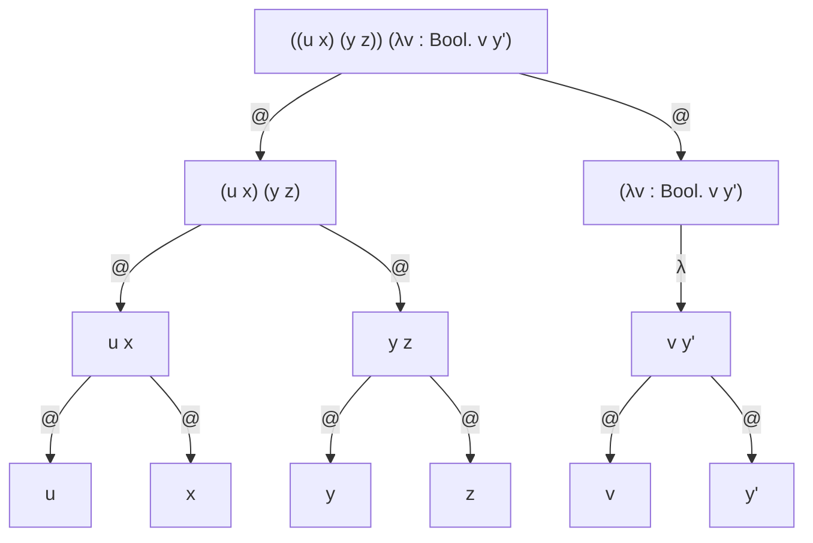
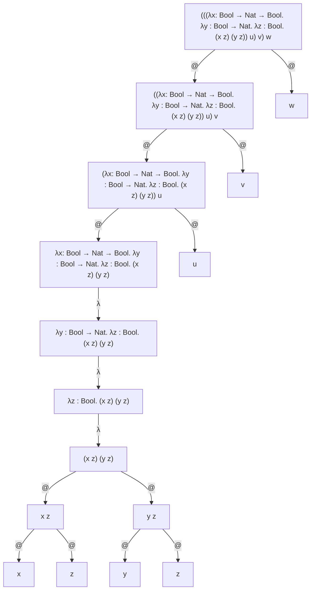
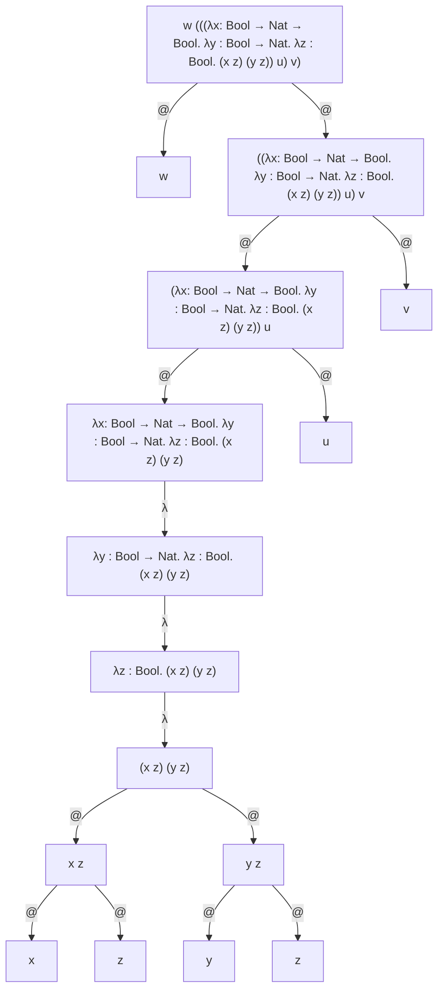

# Ejercicio 1

Vamos a analizar sintáxis, es decir, nos interesa ver que las expresiones estén sintacticamente bien formadas. No nos interesa ver si son semánticamente validas. Si son reducibles o no, no nos interesa.

(a) Válida. Expresion de término.
(b) Válida. Expresión de término. Aplicación.
(c) Inválido. M es un metavariable de la gramática, no un nombre de variable concreto, así que no es un término válido.
(d) Inválida. Como M es una metavariable de la gramática, no podemos aplicarle a una metavariable de la gramática, otra metavariable de la gramática
(e) Válida. Es una aplicación de términos bien formados.
(f) Válida. Es una aplicación de términos bien formados.
(g) Inválida. En una abstracción, las variables ligadas deben estar tipadas.
(h) Inválida. En una abstracción, las variables ligadas deben estar tipadas, y σ es una metavariable, no un tipo.
(i) Válida. Es una expresion de un término, en particular una abstracción.
(j) Inválida. El tipo de una variable debe ser un tipo ya dado, y no un término (por más que este reduzca a un tipo válido).
(k) Inválida. Es una metavariable.
(l) Válida. Es una expresión de tipo.
(m) Válida. Es una expresión de tipo.
(n) Válida. Es una expresión de tipo.
(ñ) Válida. Es una expresión de tipo.
(o) Inválida. succ true no cumple con la sintaxis ya que deberia escribirse como succ(true).
(p) Válida. Es una abstracción.

# Ejercicio 3

(a) Las ocurrencias del termino x como subtermino en `λx: Nat. succ((λx: Nat. x) x)` son:

- `λx: Nat. succ((λx: Nat. [x]) x)`
- `λx: Nat. succ((λx: Nat. x) [x])`
  Vemos que estar ligado no es una ocurrencia.

(b) ¿Ocurre $x_1$ como subtérmino en $λx_1 : Nat. succ(x_2)$?
Como dijimos en el inciso (a), estar ligado no significa ocurrir. Por lo tanto, $x_1$ no ocurre como subtérmino en dicho término.

(c) ¿Ocurre $x \; (y \; z)$ como subtérmino en $u \; x \; (y \; z)$?
No. Recordemos que la aplicación asocia a izquierda. Por lo tanto tenemos $(u \; x) \; (y \; z)$.

# Ejercicio 4

## Importante

- No aplica para las λ, pero en los árboles sintácticos, los el @ va en el medio de las dos flechas, no un @ para cada flecha.

## Inciso A

(i) `((u x) (y z)) (λv : Bool. v y)`
(ii) Renombramos la y libre de la lambda a `y'`, ya que no es la misma y que está en `(y z)`.



(iii) Vemos que la única variable ligada es v, mientras que las demas son libres.

## Inciso B

Tenemos `(λx: Bool → Nat → Bool. λy : Bool → Nat. λz : Bool. x z (y z)) u v w`.
(i) Si ponemos paréntesis y renombramos las variables que lo necesiten, tenemos:

- `(((λx: Bool → Nat → Bool. λy : Bool → Nat. λz : Bool. (x z) (y z)) u) v) w`
  (ii)



(iii) Las variables ligadas son `x`, `y`, y `z`, mientras que las libres son `u`, `v` y `w`
(iv) En este caso, la expresión dada ocurre como subtérmino.

## Inciso C

Tenemos el siguiente término: `w (λx: Bool → Nat → Bool. λy : Bool → Nat. λz : Bool. x z (y z)) u v`.

(i) Si insertamos los paréntesis y renombramos las variables que lo necesiten, nos queda:

- `w (((λx: Bool → Nat → Bool. λy : Bool → Nat. λz : Bool. (x z) (y z)) u) v)`



(iii) Las variables ligadas son `x`, `y` y `z`, mientras que las libres son `u` y `v`.

# Ejercicio 6

## Inciso A

```
                                                              ax
                                                        ―――――――――――――― T-ZERO 
       ax                          ax                   ∅ ⊢ zero : Nat
――――――――――――――― T-TRUE       ――――――――――――― T-ZERO    ―――――――――――――――――――
∅ ⊢ true : Bool              ∅ ⊢ zero: Nat           ∅ ⊢ succ(zero): Nat 
―――――――――――――――――――――――――――――――――――――――――――――――――――――――――――――――――――――――― T-IF
               ∅ ⊢ if true then zero else succ(zero) : Nat
```

## Inciso B

```
                                                      
                                                        ―――――――――――――――――――――― T-VAR
                                                        Γ, z : Bool ⊢ z : Bool              
                                                        ―――――――――――――――――――――――――――――――― T-ABS   ――――――――――――――― T-TRUE
                                                        Γ ⊢ (λz : Bool. z) : Bool → Bool         Γ ⊢ true : Bool   
――――――――――――――― T-TRUE      ―――――――――――――――― T-FALSE    ―――――――――――――――――――――――――――――――――――――――――――――――――――――――― T-APP
Γ ⊢ true : Bool             Γ ⊢ false : Bool                     Γ ⊢ (λz : Bool. z) true : Bool
――――――――――――――――――――――――――――――――――――――――――――――――――――――――――――――――――――――――――――――――――――――――――――――― T-IF
          Γ = {x : Nat, y : Bool} ⊢ if true then false else (λz : Bool. z) true : Bool

```

## Inciso C

```
        INVALIDO                   ...                      ...
――――――――――――――――――――――――      ――――――――――――――        ――――――――――――――――――――
∅ ⊢ (λx: Bool. x) : Bool      ∅ ⊢ zero : Nat        ∅ ⊢ succ(zero) : Nat
―――――――――――――――――――――――――――――――――――――――――――――――――――――――――――――――――――――――― T-IF
          ∅ ⊢ if (λx: Bool. x) then zero else succ(zero) : Nat
```

`(λx: Bool. x) : Bool` debería ser de tipo `Bool` según la regla T-IF, y no lo es.

## Inciso D

```
―――――――――――――――――― T-VAR      ―――――――――――― T-VAR
Γ ⊢ x : Bool → Nat            Γ ⊢ y : Bool
―――――――――――――――――――――――――――――――――――――――――― T-APP
Γ = {x : Bool → Nat, y : Bool} ⊢ x y : Nat

```

# Ejercicio 9

## Inciso B

Queremos hallar un término del tipo `(σ → τ → ρ) → (σ → τ) → σ → ρ`. Pensemos qué tenemos acá.

- Una funcion que toma dos parámetros, uno de tipo σ, otro de tipo τ, y devuelve un valor del tipo ρ. Llamamos f a dicha funcion, tal que `f : (σ → τ → ρ)`.
- Una funcion que toma un parámetro de tipo σ y devuelve un valor de tipo τ. Llamamos g a dicha funcion, tal que `g : (σ → τ)`.
- Un parámetro de tipo σ.
- Un resultado de tipo ρ.

Dicho esto, podemos pensar lo siguiente:
(λf: (σ → τ → ρ). λg : (σ → τ). λx: σ. f x (g x)) : (σ → τ → ρ) → (σ → τ) → σ → ρ
Tenemos `f x (g x)` ya que si vemos, f recibe primero un parámetro de tipo σ, es decir x, y luego recibe un parámetro de tipo τ, que es justamente el tipo del resultado de aplicarle un parametro de tipo σ a la funcion g.

Queremos demostrar entonces que `(σ → τ → ρ) → (σ → τ) → σ → ρ`es un tipo habitado, suponemos que el término dado es de dicho tipo. Si damos una derivación válida, entonces queda demostrado que dicho tipo es habitado.

```
           ――――――――――――――――― T-VAR   ――――――――― T-VAR        ――――――――――――― T-VAR    ――――――――― T-VAR
           Γ ⊢ f : σ → τ → ρ         Γ ⊢ x : σ              Γ ⊢ g : σ → τ          Γ ⊢ x : σ
           ――――――――――――――――――――――――――――――――――― T-APP        ―――――――――――――――――――――――――――――――― T-APP
           Γ ⊢ f x : τ → ρ                                          Γ ⊢ g x : τ
           ――――――――――――――――――――――――――――――――――――――――――――――――――――――――――――――――――――― T-APP
           Γ = {f : (σ → τ → ρ), λg : (σ → τ), λx: σ} ⊢ f x (g x) : ρ
           ―――――――――――――――――――――――――――――――――――――――――――――――――――――――――― T-ABS
           f : (σ → τ → ρ), λg : (σ → τ) ⊢ (λx: σ. f x (g x)) : σ → ρ
        ―――――――――――――――――――――――――――――――――――――――――――――――――――――――――――――――――――― T-ABS
        f : (σ → τ → ρ) ⊢ (λg : (σ → τ). λx: σ. f x (g x)) : (σ → τ) → σ → ρ
――――――――――――――――――――――――――――――――――――――――――――――――――――――――――――――――――――――――――――――――――――― T-ABS
∅ ⊢ (λf: (σ → τ → ρ). λg : (σ → τ). λx: σ. f x (g x)) : (σ → τ → ρ) → (σ → τ) → σ → ρ
```

Como logramos una derivación válida, entonces demostramos que nuestro juicio de tipado es válido. En particular, demostramos que `(σ → τ → ρ) → (σ → τ) → σ → ρ` es un tipo habitado.

# Ejercicio 10

## Inciso A

```
        ―――――――――――――― T-VAR
        x: σ ⊢ x : Nat
    ―――――――――――――――――――― T-SUCC
    x: σ ⊢ succ(x) : Nat
――――――――――――――――――――――――――――― T-ISZERO
  x: σ ⊢ isZero(succ(x)) : τ
```

Vemos que τ debe ser Bool por `T-ISZERO` y σ debe ser Nat por M debe ser de tipo Nat en succ(M).

## Inciso B

```
    ――――――――――――― T-VAR                ――――――――――――――――――――― T-ZERO
    x : σ ⊢ x : σ                      y : Bool ⊢ zero : Nat
―――――――――――――――――――――― T-ABS    ―――――――――――――――――――――――――――――――――― T-ABS
∅ ⊢ (λx: σ. x) : σ → σ          ∅ ⊢ (λy : Bool. zero) : Bool → Nat
―――――――――――――――――――――――――――――――――――――――――――――――――――――――――――――――――― T-APP
              ∅ ⊢ (λx: σ. x) (λy : Bool. zero) : σ
```

Por la rama derecha, y en particular por `(λy : Bool. zero)`, decidimos que σ = Bool → Nat. Notemos que como por la rama izquierda no tenemos ninguna restricción, entonces vemos que el término tipa con el valor de σ dado.

## Inciso C

```
          ERROR                     ...                   ...
―――――――――――――――――――――――――     ―――――――――――――     ――――――――――――――――――――――
y : τ ⊢ (λx: σ. x) : Bool     y : τ ⊢ y : σ     y : τ ⊢ succ(zero) : σ
―――――――――――――――――――――――――――――――――――――――――――――――――――――――――――――――――――――― T-IF
          y : τ ⊢ if (λx: σ. x) then y else succ(zero) : σ

```

Obtenemos un "ERROR" ya que la regla a aplicar en la rama izquierda debe ser T-ABS, sin embargo Bool no cumple con la condición de ser de un tipo τ → σ

# Ejercicio 13

## Inciso A

Queremos realizar la siguiente sustitucion: `(λy : σ. x (λx: τ. x)){x := (λy : ρ. x y)}`. Recordemos que la operación sustitución *M{x := N}* denota el término que resulta de reemplazar todas las ocurrencias libres de x en *M* por *N*. Renombremos las variables, tal que la nueva sustitución es la siguiente:
Por lo tanto, renombremos las `x` y las `y` ligadas para que no "choquen" con las `x` y las `y` presentes en el N de la sustitución.

- `(λy' : σ. x (λx': τ. x')){x := (λy : ρ. x y)}`

Por lo tanto, al realizar la sustitución obtenemos:

- `(λy' : σ. (λy : ρ. x y) (λx': τ. x'))`

## Inciso B

Queremos realizar la siguiente sustitución: `(y (λv : σ. x v)){x := (λy : τ. v y)}`.

En el término original, vemos que la única variable ligada es v, que también aparece en el N de la sustitución, por lo tanto, la renombramos, tal que la nueva sustitución a realizar es:

- `(y (λv' : σ. x v')){x := (λy : τ. v y)}`

Al realizar la sustitución obtenemos:

- `(y (λv' : σ. (λy : τ. v y) v'))`

# Ejercicio 15

(a)
Tenemos la siguiente expresión: `(λx: Bool. x) true`. Queremos ver si es o no un valor. Recordemos que los valores son expresiónes irreducibles, es decir, que están en forma normal, sin embargo, este término es reducible, en particular es una aplicación. Si es reducible, entonces no es un valor.

(b)
`λx: Bool. 2` es un valor ya que es irreducible. En particular, es de la forma `λx: τ. M`.

(d)
Tenemos la siguiente expresión: `λy : Nat. (λx: Bool. pred(2)) true`. Si analizamos únicamente `(λx: Bool. pred(2)) true`, podríamos decir rápidamente que la expresión en general no es un valor, ya que es reducible, y por lo tanto no está en forma normal. Sin embargo, no conocemos ninguna regla de evaluación para reducir una lambda. Solo conocemos reglas para aplicaciones entre lambdas y otros términos.
Entonces como no podemos reducir el término, decimos que está en forma normal, y en particular es un valor.

# Ejercicio 16

(i) `i (λx: Bool. x) true`
La siguiente expresión puede ser considerada un programa, ya que tipa en el contexto vacio. Por otro lado, no es una forma normal, ya que podemos reducirla con `E-APPABS`. Si aplicamos dicha regla, llegamos a un valor, en particular, `true`.

(ii) `λx: Nat. pred(succ(x))`
Notemos que la siguiente expresión es un programa, ya que tipa en el contexto vacío. Por otro lado, se trata de una forma normal, y es en particular un valor, ya que es de la forma `λx: τ. M`.

(iii) `λx: Nat. pred(succ(y))`
No se trata de un programa ya que no tipa en el contexto vacío, no sabemos el tipo de y.

(iv) `(λx: Bool. pred(isZero(x))) true`
La siguiente expresión es un programa ya que tipa en el contexto vacío. Veamos a qué llegamos al reducirlo.

- `(λx: Bool. pred(isZero(x))) true` ― `E-APPABS` → `pred(isZero(true))`.
- Vemos que tenemos la regla `E-PRED` que nos permite reducir `pred(M)` a `pred(M')` si M se puede reducir a M', sin embargo `isZero(M)` requiere que M sea de tipo Nat, y true es de tipo Bool, por lo tanto este es un programa que al evaluarlo resulta en un error.

(v) `(λf : Nat → Bool. f zero) (λx: Nat. isZero(x))`
En un principio parece ser una aplicación, vemos que además todas las variables (`f` y `x`) aparecen ligadas y tipadas, por lo que en un principio es un programa. Evaluemos el programa y veamos si llega a un valor o un error.

- `(λf : Nat → Bool. f zero) (λx: Nat. isZero(x))` ― `E-APPABS` → `(λx: Nat. isZero(x)) zero` ― `E-APPABS` → `isZero(zero)` ― `E-ISZEROZERO` → `true`

Vemos que el programa llega a un valor, en particular `true`.

(vii) `(λf : Nat → Bool. f pred(zero)) (λx: Nat. isZero(x))`
Nuevamente pareciera ser una aplicación. Vemos que las variables están ligadas y tipadas, por lo que es un programa. Veamos a qué llegamos en la evaluación.

- `(λf : Nat → Bool. f pred(zero)) (λx: Nat. isZero(x))` ― `E-APPABS` → `(λx: Nat. isZero(x)) pred(zero)` → `ERROR`

Si queremos reducir `(λx: Nat. isZero(x)) pred(zero)`, primero debemos reducir `pred(zero)`, sin embargo por consigna, esto no es posible, por ende el programa llega a un error.

# Ejercicio 20

*Nota: Se puede encontrar este ejercicio resuelto en el Pizarron 2 TM.*

Se extiende el calculo lambda tipado con pares.

- Se extienden los tipos de la forma: $\tau ::= \dots \mid \tau \times \tau$
- Se extienden los términos de la forma: $M ::= \dots \mid \langle M, M\rangle \mid \pi_{1}(M)\mid \pi_{2}(M)$

Notemos que un par de la forma $\langle M_1, M_2\rangle$ es del tipo $\sigma \times \tau$ si $M_1 :: \sigma$ y $M_2 :: \tau$.
Por lo tanto $\langle M_1, M_2\rangle :: \sigma \times \tau$.

Luego para acceder al primer elemento del par M, utilizamos $\pi_{1}(M)$ mientras que para acceder al segundo elemento del par M, utilizamos $\pi_{2}(M)$.

## Inciso A

Se pide definir reglas de tipado para los nuevos constructores de términos. Recordemos que una regla de tipado es aquella que dado un término, nos permite saber el tipo del mismo.
Primero pensemos qué términos se introducen, luego hacemos una regla para cada uno:

- Se introducen los pares, un par es de un tipo $\sigma \times \tau$ si el primer elemento es de tipo $\sigma$ y el segundo es de tipo $\tau$, por lo tanto, vamos a pedir que se cumplan dichas condiciones. A esta regla la llamaremos T-PAR.
- Dado un par de tipo $\sigma \times \tau$, si queremos el primer elemento del par, entonces será de tipo $\sigma$. Lo podemos llamar T-π₁.
- Dado un par de tipo $\sigma \times \tau$, si queremos el segundo elemento del par, entonces será de tipo $\tau$. Lo podemos llamar T-π₂.

```

Γ ⊢ P₁ : σ    Γ ⊢ P₂ : τ
―――――――――――――――――――――――― T-PAR
Γ ⊢ ⟨P₁, P₂⟩ : σ × τ


Γ ⊢ P : σ × τ           Γ ⊢ P : σ × τ
――――――――――――― T-π₁      ――――――――――――― T-π₂
Γ ⊢ π₁(P) : σ           Γ ⊢ π₂(P) : τ
```

## Inciso B

(iv) Queremos exhibir un habitante del siguiente tipo: ((σ × τ) × ρ) → (σ × (τ × ρ)).
Veamos qué tenemos, así armamos una expresión que cumpla ser del tipo dado. Luego lo demostramos.
Vemos que tenemos una función que toma un valor del tipo ((σ × τ) × ρ) y devuelve un valor del tipo (σ × (τ × ρ)). Es decir, vamos a recibir un par de la forma ⟨⟨σ × τ⟩, ρ⟩ y vamos a devolver otro del tipo ⟨σ, ⟨τ × ρ⟩⟩.
Por lo tanto, proponemos la siguiente expresión: (λv : ((σ × τ) × ρ). ⟨π₁(π₁(v)), ⟨pi2(π₁(v)) × π₂(v)⟩⟩) : ⟨σ, ⟨τ × ρ⟩⟩. Demostrémoslo:

```
                                      ――――――――――――――――――――― T-VAR
                                      Γ ⊢ v : ((σ × τ) × ρ) 
    ――――――――――――――――――――― T-VAR       ―――――――――――――――――――――        ――――――――――――――――――――― T-VAR
    Γ ⊢ v : ((σ × τ) × ρ)               Γ ⊢ π₁(v) : σ × τ          Γ ⊢ v : ((σ × τ) × ρ)
    ―――――――――――――――――――― T-π₁           ――――――――――――――――― T-π₂     ――――――――――――――――――――― T-π₂
    Γ ⊢ (π₁(v)) : σ × τ                 Γ ⊢ π₂(π₁(v)) : τ             Γ ⊢ π₂(v) : ρ
    ――――――――――――――――――― T-π₁            ――――――――――――――――――――――――――――――――――――――――――― T-PAR
    Γ ⊢ ⟨π₁(π₁(v)) : σ                        Γ ⊢ ⟨π₂(π₁(v)), π₂(v)⟩ : (τ × ρ)
    ―――――――――――――――――――――――――――――――――――――――――――――――――――――――――――――――――――――――――― T-PAR
    Γ = {v : ((σ × τ) × ρ)} ⊢ (⟨π₁(π₁(v)), ⟨π₂(π₁(v)), π₂(v)⟩⟩) : (σ × (τ × ρ))
――――――――――――――――――――――――――――――――――――――――――――――――――――――――――――――――――――――――――――――――――――――――― T-ABS
∅ ⊢ (λv : ((σ × τ) × ρ). ⟨π₁(π₁(v)), ⟨π₂(π₁(v)) π₂(v)⟩⟩) : ((σ × τ) × ρ) → (σ × (τ × ρ))
```

## Inciso C

$V ::= \dots \mid \langle V, V\rangle$

## Inciso D

Recordemos qué eran las reglas de semántica operacional y las reglas de conguencia.

- Semántica Operacional: Define las reglas principales de reducción (como si fuesen β's). Es decir, cuándo y cómo un término de cierta forma se transforma en otro en un paso de ejecución (small-step).
- Congruencia: Nos dice cómo podemos ir reduciendo términos que no pueden ser evaluados todavía, de esta manera podemos ir acercándonos a una expresión que pueda ser evaluada, y en ese caso, utilizar una regla de semántica operacional.

**Reglas de semántica operacional:**

```
――――――――――――――――― E-π₁       ――――――――――――――――― E-π₂
π₁(⟨V₁, V₂⟩) → V₁            π₂(⟨V₁, V₂⟩) → V₂
```

**Reglas de congruencia:**
Notemos que para usar π en un par, necesitamos que el valor a proyectar sea una forma normal, es decir, debe ser irreducible. Por lo tanto nos referimos a tuplas de valores con V, y tuplas de términos (no en forma normal) con M.

```
      M → M'                       N → N'
―――――――――――――――― E-PAR₁      ―――――――――――――――― E-PAR₂
⟨M, N⟩ → ⟨M', N⟩             ⟨M, N⟩ → ⟨M, N'⟩


     M → M'                      M → M'
―――――――――――――― E-PARπ₁       ―――――――――――――― E-PARπ₂
π₁(M) → π₁(M')               π₂(M) → π₂(M')
```

# Ejercicio 22

Se extiende el cálculo lambda tipado con listas.

Extendemos el conjunto de tipos: $\tau ::= \dots \mid [\tau]$. $[\tau]$ representa el tipo de las listas cuyas componentes son del tipo $\tau$.
Extendemos el conjunto de términos:
$M,N,O ::= \dots \mid []_{\tau} \mid M::N \mid \mathsf{case}\;M\;\mathsf{of}\;\{[]\rightsquigarrow N\mid h::t\rightsquigarrow O\}\mid \mathsf{foldr}\;M\;\mathsf{base}\;\rightsquigarrow\;N,\;\mathsf{rec}(h,r)\;\rightsquigarrow\;O$

- $[]_{\sigma}$ es la lista vacía de elementos de tipo $\sigma$.
- $M :: N$ agrega $M$ a la lista $N$
- $\mathsf{case}\;M\;\mathsf{of}\;\{[]\;\rightsquigarrow\;N\;\mid\;h::t\;\rightsquigarrow\;O\}$ es el observador de listas
- $\mathsf{foldr}\;M\;\mathsf{base}\;\rightsquigarrow\;N\;;\;\mathsf{rec}(h,r)\;\rightsquigarrow\;O$ es el operador de recursión estructural

## Inciso B

- Lista vacía
- Foldr
- Case
- Concat

```
――――――――――――― T-VACIA
Γ ⊢ []τ : [τ]


Γ ⊢ M : [σ]    Γ ⊢ N : τ    Γ, h : σ, r : τ ⊢ O : τ
――――――――――――――――――――――――――――――――――――――――――――――――――― T-FOLDR
      Γ ⊢ foldr M base → N; rec(h, r) → O : τ


Γ ⊢ M : [σ]    Γ ⊢ N : τ    Γ, h : σ, t : [σ] ⊢ O : τ
――――――――――――――――――――――――――――――――――――――――――――――――――――― T-CASE
       Γ ⊢ case M of {[] → N | h :: t → O} : τ


Γ ⊢ M : τ    Γ ⊢ N : [τ]
―――――――――――――――――――――――― T-APPEND
    Γ ⊢ M :: N : [τ]
```

## Inciso C

```――――――――――――
                      Γ ⊢ x : Bool          Γ ⊢ y : [Bool]
―――――――――――― T-VAR    ―――――――――――――――――――――――――――――――――――― T-APPEND                         ――――――――――――― T-VAR    ――――――――――――――― T-VAR    ―――――――――――――――――――― T-VACIA
Γ ⊢ x : Bool                    Γ ⊢ x::y : [Bool]                                           Γ' ⊢ h : Bool          Γ' ⊢ r : [Bool]          Γ' ⊢ []Bool : [Bool]  
――――――――――――――――――――――――――――――――――――――――――――――――― T-APPEND          ―――――――――――――― T-VAR    ―――――――――――――――――――――――――――――――――――――――――――――――――――――――――――――――――――― T-IF
        Γ ⊢ x::x::y : [Bool]                                        Γ ⊢ y : [Bool]           Γ' = {Γ, h : Bool, r : [Bool]} ⊢ if h then r else []Bool : [Bool]  
―――――――――――――――――――――――――――――――――――――――――――――――――――――――――――――――――――――――――――――――――――――――――――――――――――――――――――――――――――――――――――――――――――――――――――――――――――――――――――――― T-FOLDR
   Γ = {x : Bool, y : [Bool]} ⊢ foldr x::x::y base → y; rec(h, r) → if h then r else []Bool : [Bool]
```

## Inciso D

$V ::= ... \mid []_{\tau} \mid V :: V$

## Inciso E

Se pide dar los axiomas de semántica operacional y las reglas de congruencia.

**Reglas de Congruencia**
```
      M → M'                        N → N'
―――――――――――――――― E-APPEND₁    ―――――――――――――――― E-APPEND₂
M :: N → M' :: N              V :: N → V :: N'


                            M → M'
―――――――――――――――――――――――――――――――――――――――――――――――――――――――――――――――――― E-CASE
case M of {[] → N | h :: t → O} → case M' of {[] → N | h :: t → O}


                                M → M'
―――――――――――――――――――――――――――――――――――――――――――――――――――――――――――――――――――――― E-FOLDR
(foldr M base → N; rec(h, r) → O) → (foldr M' base → N; rec(h, r) → O)
```

**Axiomas de Semántica Operacional**
```
―――――――――――――――――――――――――――――――――――――― E-NIL-FOLDR
(foldr [] base → N; rec(h, r) → O) → N

――――――――――――――――――――――――――――――――――――――――――――――――――――――――――――――――――――――――――――――――――――――― E-CONS-FOLDR
(foldr h'::t base → N; rec(h, r) → O) → O{h := h', r := foldr t base → N; rec(h, r) → O}


―――――――――――――――――――――――――――――――――――― E-CASE-NIL
case [] of {[] → N | h :: t → O} → N

―――――――――――――――――――――――――――――――――――――― E-CASE-CONS
case h::t of {[] → N | h :: t → O} → O
```


―   ⊢   Γ
σ   τ   π
₁   ₂   ∅
⟨   ⟩   →

# Ejercicio 23

# Ejercicio 24

# Ejercicio 27
